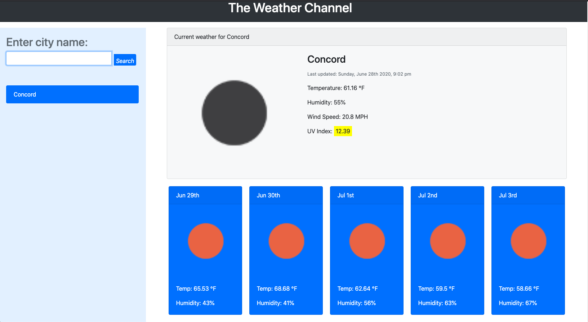

# Weather Channel!!!
By Mario Viana
## Mock-up

How is our climate, that is the question that we sometimes ask ourselves, with this application 
we will be able to see the different climates of many cities, this will show us the 5 days of forecast,
it will also provide us with more interesting data for how the weather will be during the day, for this 
website we use different programs to develop this application, we can mention HTML, CSS, Javascript, we 
also use the bootstrap framework, such as JSON and Jquery. It was a combination of code but we also 
obtained information from our API's to obtain the 5-day forecast, we thank openweather for providing 
the key to pull the data.

We hope this helped many people to check the weather in the city where they are.